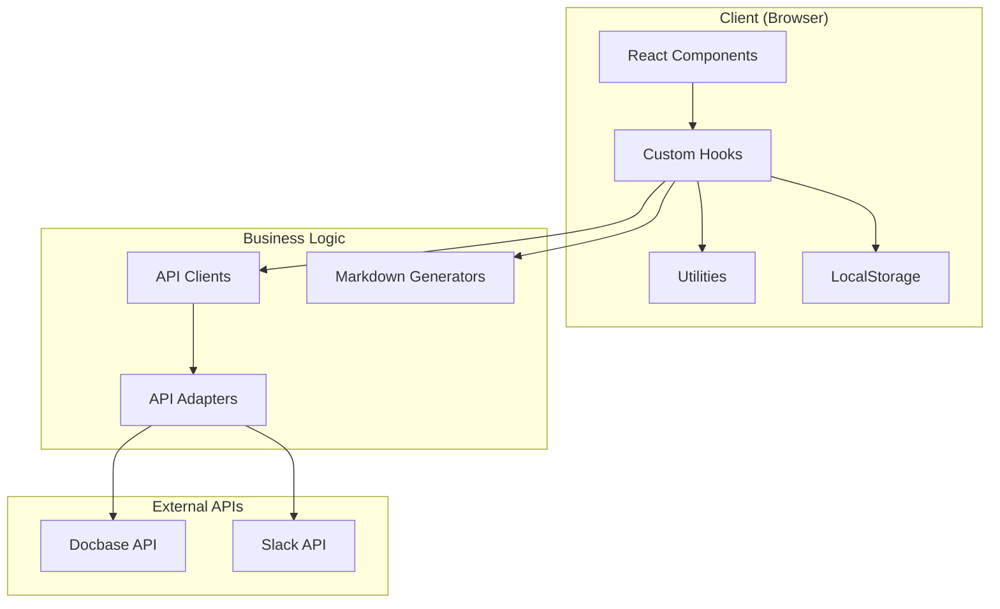
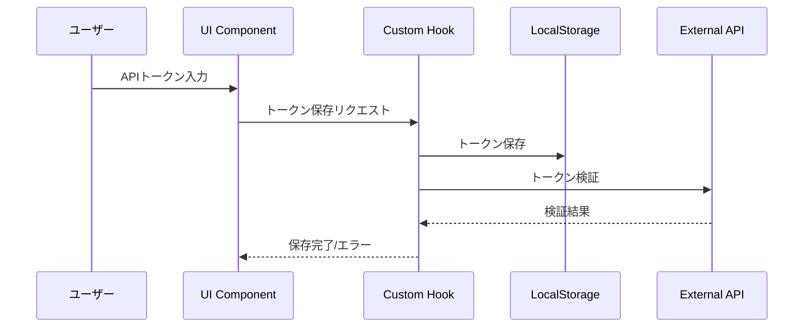
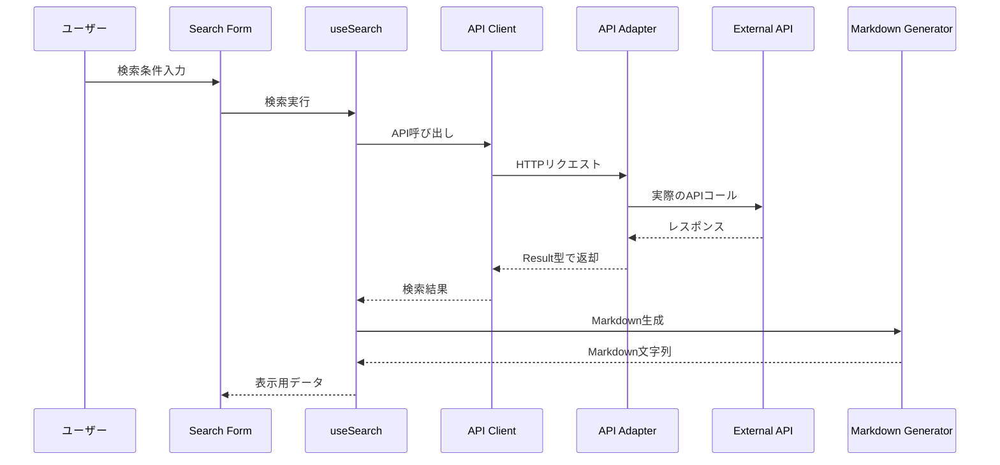

# アーキテクチャ設計書

## 概要

NotebookLM CollectorはNext.js 15をベースとしたWebアプリケーションで、DocbaseとSlackからデータを収集し、NotebookLM向けにMarkdown形式で出力します。すべての処理はブラウザ内で完結し、セキュアな環境でデータを扱います。

## システム構成図



## 技術スタック

### フロントエンド
- **フレームワーク**: Next.js 15 (App Router)
- **UI ライブラリ**: React 19
- **スタイリング**: Tailwind CSS v4
- **型システム**: TypeScript 5.x

### 開発ツール
- **ビルドツール**: Next.js内蔵
- **リンター/フォーマッター**: Biome
- **テスト**: Vitest, Playwright
- **ドキュメント**: Storybook v8

### ライブラリ
- **エラーハンドリング**: neverthrow
- **状態管理**: React hooks
- **Markdown処理**: 自作ユーティリティ

## ディレクトリ構造

```
src/
├── app/                 # Next.js App Router
│   ├── layout.tsx      # ルートレイアウト
│   ├── page.tsx        # ホームページ
│   ├── docbase/        # Docbaseページ
│   └── slack/          # Slackページ
├── components/          # UIコンポーネント
│   ├── *Form.tsx       # フォーム関連
│   ├── *Input.tsx      # 入力フィールド
│   └── *Preview.tsx    # プレビュー表示
├── hooks/              # カスタムフック
│   ├── useSearch.ts    # 検索ロジック
│   ├── useDownload.ts  # ダウンロード機能
│   └── useLocalStorage.ts # ストレージ管理
├── lib/                # ビジネスロジック
│   ├── docbaseClient.ts # Docbase APIクライアント
│   └── slackClient.ts   # Slack APIクライアント
├── adapters/           # 外部API連携
│   ├── types.ts        # アダプター型定義
│   ├── docbaseAdapter.ts # Docbase実装
│   └── slackAdapter.ts   # Slack実装
├── types/              # 型定義
│   ├── docbase.ts      # Docbase関連型
│   ├── slack.ts        # Slack関連型
│   └── error.ts        # エラー型
└── utils/              # ユーティリティ関数
    ├── markdownGenerator.ts # Markdown生成
    ├── errorStorage.ts      # エラー保存
    └── fileDownloader.ts    # ファイルダウンロード
```

## データフロー

### 1. 認証フロー



### 2. 検索フロー



## セキュリティ設計

### 1. データ保護
- **ブラウザ完結処理**: すべてのデータ処理はクライアントサイドで実行
- **外部送信なし**: APIトークンや取得データは外部サーバーに送信されない
- **HTTPS通信**: 外部APIとの通信はすべてHTTPS

### 2. トークン管理
- **LocalStorage保存**: 利便性のためトークンを保存（将来的に暗号化予定）
- **有効期限管理**: トークンの有効期限チェック（実装予定）
- **スコープ制限**: 最小限の権限のみ要求

### 3. XSS対策
- **サニタイズ処理**: ユーザー入力とAPIレスポンスのサニタイズ
- **CSPヘッダー**: Content Security Policy設定（実装予定）
- **React自動エスケープ**: Reactの標準的なXSS防御機能を活用

## パフォーマンス最適化

### 1. レンダリング最適化
- **React.memo**: 不要な再レンダリング防止
- **仮想スクロール**: 大量データの効率的表示（実装予定）
- **遅延ローディング**: コンポーネントの動的インポート

### 2. ネットワーク最適化
- **ページネーション**: APIコールの分割
- **並列処理**: 複数APIの同時呼び出し
- **エラーリトライ**: 失敗時の自動再試行

### 3. バンドルサイズ最適化
- **Tree Shaking**: 未使用コードの除去
- **Dynamic Import**: 必要時のみコード読み込み
- **依存関係の最適化**: 不要なパッケージの削除

## エラーハンドリング

### 1. Result型パターン

```typescript
// neverthrowを使用したエラーハンドリング
type ApiError = 
  | { type: 'network'; message: string }
  | { type: 'unauthorized'; message: string }
  | { type: 'validation'; message: string }

async function fetchData(): Promise<Result<Data, ApiError>> {
  // 実装
}
```

### 2. エラー境界
- **ErrorBoundary**: Reactコンポーネントのエラーキャッチ
- **エラーレポート**: エラー情報の保存と表示
- **フォールバックUI**: エラー時の代替表示

### 3. ユーザーフィードバック
- **分かりやすいメッセージ**: 技術的でない言葉で説明
- **アクション提案**: エラー解決方法の提示
- **リトライ機能**: 簡単な再実行オプション

## スケーラビリティ

### 1. コード構造
- **モジュラー設計**: 機能ごとの独立性
- **アダプターパターン**: 新しいAPIの追加が容易
- **型安全性**: TypeScriptによる保守性向上

### 2. 将来の拡張性
- **プラグインアーキテクチャ**: 新しいサービス連携の追加
- **国際化対応**: 多言語サポートの準備
- **テーマ機能**: ダークモード対応（実装予定）

### 3. テスト戦略
- **単体テスト**: 各関数・コンポーネントの独立テスト
- **統合テスト**: APIクライアントの動作確認
- **E2Eテスト**: ユーザーシナリオの自動テスト

## デプロイメント

### 1. ビルドプロセス
```bash
# 本番ビルド
npm run build

# 静的ファイル生成
npm run export
```

### 2. ホスティング
- **Vercel**: 推奨（Next.jsとの親和性）
- **Netlify**: 代替オプション
- **GitHub Pages**: 静的ホスティング

### 3. 環境設定
- **環境変数**: `.env.local`での管理
- **ビルド時設定**: next.config.tsでの設定
- **実行時設定**: クライアントサイドでの動的設定

## モニタリング

### 1. エラー追跡
- **エラーログ**: LocalStorageへの保存
- **エラー分析**: 頻出エラーの特定
- **ユーザーレポート**: フィードバック機能

### 2. パフォーマンス監視
- **Core Web Vitals**: LCP, FID, CLSの測定
- **APIレスポンス時間**: 遅延の検出
- **バンドルサイズ**: ビルドごとのサイズ追跡

### 3. 使用状況分析
- **機能利用率**: 各機能の使用頻度
- **エラー率**: 成功/失敗の比率
- **ユーザーフロー**: 典型的な使用パターン

## まとめ

NotebookLM Collectorは、セキュリティとユーザビリティを重視した設計となっています。ブラウザ完結型のアーキテクチャにより、ユーザーのデータを安全に扱いながら、高いパフォーマンスを実現しています。今後も継続的な改善により、より使いやすく、より安全なツールを目指します。